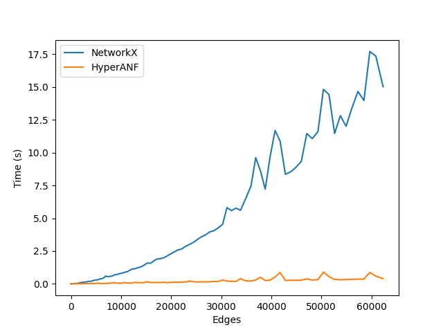

# HyperANF Python Implementation

This repository contains a Python implementation of [Paolo Boldi, Marco Rosa, Sebastiano Vigna - "HyperANF: Approximating the Neighbourhood Function of Very Large Graphs on a Budget"](https://arxiv.org/pdf/1011.5599). 

The library computes the power of a graph's adjacency matrix. Differently than [NetworkX implementation](https://networkx.org/documentation/stable/reference/algorithms/generated/networkx.algorithms.operators.product.power.html), it computes the power graph for directed graph as well much more efficiently.



## Installation

```
pip install git+https://github.com/n28div/hyperhanfpy
```

## Example

```python
>>> import networkx
>>> g = networkx.gnp_random_graph(5, 0.5, seed=42)
>>> from hyperhanfpy import HyperANF
>>> hanf = HyperANF(g)
>>> pg = hanf.power(3)
EdgeView([(0, 2), (0, 3), (0, 4), (2, 3), (2, 4), (3, 4)])
```

## Acknowledgments

The initial codebase of this implementation derives from [ppanf](https://github.com/algarecu/ppanf).